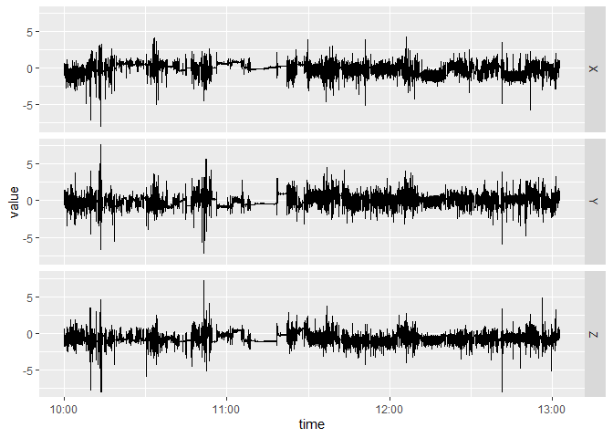

[](https://github.com/zichun-xu/bis620/actions/workflows/R-CMD-check.yaml)

<!-- README.md is generated from README.Rmd. Please edit that file -->

# bis620.2022

<!-- badges: start -->
<!-- badges: end -->

The goal of bis620.2022 is to produce exploratory analysis tools for the
UK Biobank accelerometry data, including:  
a. time series plot  
b. spectral signature calculation

## Installation

You can install the development version of bis620.2022 from
[GitHub](https://github.com/) with:

``` r
# install.packages("devtools")
devtools::install_github("zichun-xu/bis620")
#> Skipping install of 'bis620.2022' from a github remote, the SHA1 (cd5408c6) has not changed since last install.
#>   Use `force = TRUE` to force installation
```

## Example

1.  Load the UK Biobank accelerometry data

``` r
library(bis620.2022)
data("ukb_accel")
```

2.  Time series plots of the data:

``` r
accel_plot(ukb_accel)
```



3.  Calculate the spectral signature of the Data

``` r
spectral_signature(ukb_accel)
#> # A tibble: 540,000 × 4
#>          X      Y       Z      freq
#>      <dbl>  <dbl>   <dbl>     <dbl>
#>  1  78038. 28208. 753298. 0.0000913
#>  2 153932. 98732.  53521. 0.0000913
#>  3  43385. 58240.  66251. 0.0000913
#>  4  53004. 50652.  10922. 0.0000913
#>  5  97164. 76529.  59418. 0.0000913
#>  6  30740. 49130. 101001. 0.0000913
#>  7 116648. 58509.  84698. 0.0000913
#>  8  43271. 55604.  39442. 0.0000913
#>  9  63228. 73288.  46781. 0.0000913
#> 10  56477. 17581.  70102. 0.0000913
#> # … with 539,990 more rows
```

## Links to Actions

#### 1. Test Coverage: <https://github.com/zichun-xu/bis620/actions/workflows/test-coverage.yaml>

#### 2. lint: <https://github.com/zichun-xu/bis620/actions/workflows/lint.yaml>
