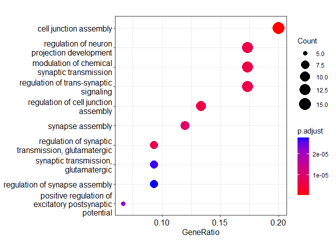
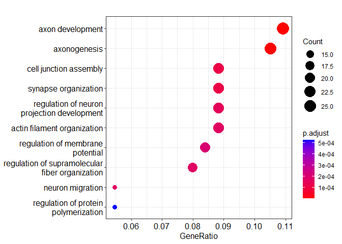
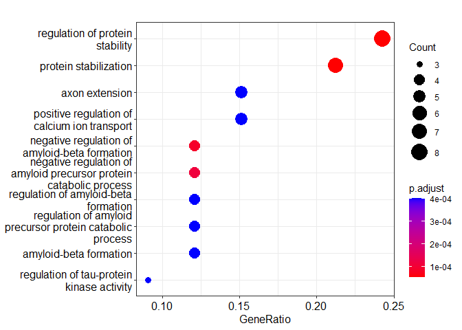
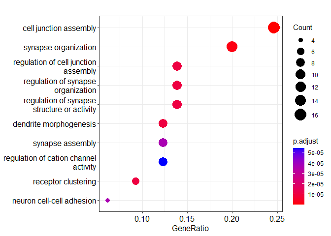
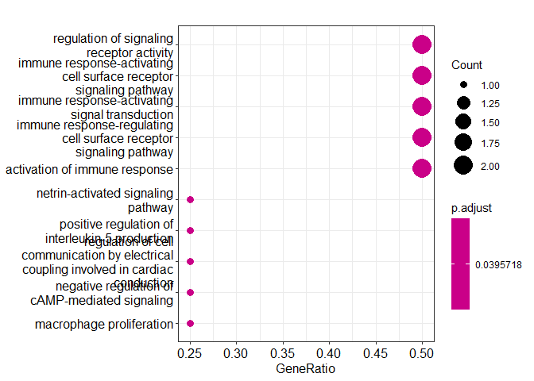

[](https://github.com/zichun-xu/bis620/actions/workflows/R-CMD-check.yaml)
[](https://github.com/zichun-xu/bis620/actions/workflows/lint.yaml)
[](https://github.com/zichun-xu/bis620/actions/workflows/test-coverage.yaml)

<!-- README.md is generated from README.Rmd. Please edit that file -->

# bis620.2022

<!-- badges: start -->
<!-- badges: end -->

The goal of bis620.2022 is to produce a set of tools for the
cell-type-specific co-expression analysis of the Alzheimer’s disease
(AD) single-cell RNA-sequencing data
(<https://www.pnas.org/doi/abs/10.1073/pnas.2008762117>), Main tools
include:  
a. extract the data of cells from a specific cell type and disease
conditions (AD or control)  
b. estimate co-expression network with Pearson or Spearman correlation  
c. estimate the differential co-expression network (AD vs control) with
Pearson or Spearman correlation  
d. find highly co-expressed gene modules  
e. conducnt GO enrichment anlaysis

## Installation

You can install the development version of bis620.2022 from
[GitHub](https://github.com/) with:

``` r
# install.packages("devtools")
devtools::install_github("zichun-xu/bis620")
#> Skipping install of 'bis620.2022' from a github remote, the SHA1 (731ff7c7) has not changed since last install.
#>   Use `force = TRUE` to force installation
```

## Data Description

The main data we will use in this project is a single-cell
RNA-sequencing (scRNA-seq) dataset collected from AD and control
samples. The data was collected by profiling 169,496 nuclei from the
prefrontal cortical samples of 12 Alzheimer’s disease (AD) patients and
9 healthy controls using single-nucleus RNA sequencing technology. Major
brain cell types including excitatory neurons, inhibitory neurons,
microglia, astrocytes, oligodendrocytes, and endothelial cells were
categorized by performing manifold approximation and projection (UMAP)
clustering on the dataset and identifying cell-type-specific marker
genes within each cluster. For demonstration purpose, we sampled a total
of 20,000 nuclei (cells) and included the data as
“data-raw/snRNA_seq_PNAS_AD.rds”

## Background and motivation

Co-expression networks characterize the co-variation of gene expression
levels, and changes in co-expression patterns are usually associated
with changes in gene regulation or disturbed biological pathways.
Co-expression network analyses with bulk samples such as microarray and
RNA sequencing data has offered rich insights into gene regulatory
dynamics in the brain and disease mechanisms of AD. However, as bulk
samples aggregate gene expressions from a single person, co-expression
networks on bulk data fail to capture the cell-type-specificity of
co-expression relationships. Specifically in the brain, each major brain
cell type (excitatory neurons, inhibitory neurons, microglia,
oligodendrocytes, and astrocytes) performs specific functions and they
may play different roles in the progression of AD. These information can
only be characterized with cell-type-specific co-expression networks.
The rapid development of single-cell RNA-seq technology has enabled
researchers to study gene expression dynamicsat an individual cell
level. This allows the separation of different cell types and the
construction of cell-type specific co-expression networks.

## Research Questions

In this project, our goal is to estimate the cell-type-specific gene
co-expression networks in major brain cell types, including excitatory
neurons, inhibitory neurons, microglia, astrocytes, and oligodendrocytes
(endothelial cells are excluded here due to a small sample size) from
both AD patients and healthy controls. We will characterize the changes
of gene co-expression relationships as a result of AD.

## Data Analysis and Interpretation

In the analysis below, we will focus on two cell types, excitatory
neurons and microglia, which both have strong implications in AD. Other
cell types can be analyzed in a similar fashion with the functions
provided in this package.

### Example I: Cell-type-specific Co-expression Network Analysis of Excitatory Neuron

1.  Load the excitatory neuron single-cell RNA-seq data (top 500 highly
    expressed genes) from the control group

``` r
library(bis620.2022)
#> 
#> 
dat = GetData(1:500, cell_type = "Ex", status = "NC")
dim(dat)
#> [1] 3691  500
```

2.  Construct the co-expression network estimated with Spearman
    correlation  
    The co-expression network was constructed by estimating the Pearson
    or Spearman correlation between genes. Gene pairs with
    non-significant p-values (calculated with correlation) after
    multiple testing correction were considered not co-expressed (0
    co-expression).

``` r
spearman_net = CoExpNet(dat, method = "spearman")
print(spearman_net[1:5, 1:5])
#>             MALAT1       PCDH9       CADM2       DLG2       MAGI2
#> MALAT1  1.00000000 -0.06946072 -0.12250902 0.10761140 -0.04969517
#> PCDH9  -0.06946072  1.00000000  0.23127889 0.22677043  0.22521986
#> CADM2  -0.12250902  0.23127889  1.00000000 0.09852439  0.24376896
#> DLG2    0.10761140  0.22677043  0.09852439 1.00000000  0.09074754
#> MAGI2  -0.04969517  0.22521986  0.24376896 0.09074754  1.00000000
```

``` r
print(paste0("density: ", round(mean(spearman_net[upper.tri(spearman_net)] != 0), digits = 3)))
#> [1] "density: 0.837"
degree = rowSums(abs(spearman_net))
degree[sort.int(degree, decreasing = T, index.return = T)$ix[1:10]] # hub genes
#>   MT-CO3   MT-ND4   MT-CO2   MT-CO1  MT-ATP6   MT-ND3   MT-ND1   MT-ND2 
#> 73.82101 70.38990 70.30778 70.03747 69.14032 68.37977 62.40222 59.67652 
#>   HS6ST3    PTPRD 
#> 58.66479 58.58701
```

We can see that a significant proportion of gene pairs were
co-expression (83.6%), and the top hub genes were enriched with mito
genes. These suggests that excitaory neurons are highly active in the
brain (many gene activities), and mito genes tend to connect with many
other highly expressed genes.

3.  Find highly co-expressed gene modules Highly co-expressed gene
    modules were identified by performing hierarchical clustering on the
    co-expression network.

``` r
modules = Clustering(spearman_net, num_clusters = 10, min_size = 5)
#> memb
#>   1   2   3   4   5   6   7   8   9  10 
#>   6   4  81  20  12  77   9 255  33   3
```

4.  GO Enrichment Analysis (this can take a while to run)

``` r
ego = EnrichGO(modules[[1]])
#> [1]  46 223  25   7  83 284 303
```

``` r
enrichplot::dotplot(ego[[2]])
```



``` r
enrichplot::dotplot(ego[[7]])
```



``` r
enrichplot::dotplot(ego[[8]])
```

 We
found eight highly co-expressed gene modules from the top 500 highly
expressed genes in excitatory neurons. We took a closer look at the top
three modules with the highest number of enriched GO terms. All three
modules have a strong connection with neuro-activities (such as synapse,
axon, etc.), which is expected for excitatory neurons. This suggests
that cell-type-specific co-expression network can characterize the
functions of different cell types.

### Example II: Cell-type-specific Differential Co-expression Network Analysis of Microglia

1.  Load the microglia single-cell RNA-seq data (top 100 highly
    expressed genes) from the control and AD group

``` r
dat_control = GetData(1:100, cell_type = "Mic", status = "NC")
dat_AD = GetData(1:100, cell_type = "Mic", status = "AD")
dim(dat_control)
#> [1] 573 100
dim(dat_AD)
#> [1] 575 100
```

We only select the top 100 genes (instead of the top 500), as
differential co-expression analysis requires more signal, and analyses
on genes with relatively low expression levels may lack power.

2.  Construct the differential co-expression network estimated with
    Spearman correlation The differential co-expression network was
    constructed by taking the difference of the co-expression network
    estimated separately from two conditions (AD vs control). A
    permutation test that randomly permute labels was employed to
    threshold gene pairs with insignificant co-expression differences.

``` r
spearman_diff_net = DifferentialNet(n_counts_1 = dat_AD, n_counts_2 = dat_control, method = "spearman", rep = 100, seed = 20221220)
#>   |                                                                              |                                                                      |   0%  |                                                                              |=                                                                     |   1%  |                                                                              |=                                                                     |   2%  |                                                                              |==                                                                    |   3%  |                                                                              |===                                                                   |   4%  |                                                                              |====                                                                  |   5%  |                                                                              |====                                                                  |   6%  |                                                                              |=====                                                                 |   7%  |                                                                              |======                                                                |   8%  |                                                                              |======                                                                |   9%  |                                                                              |=======                                                               |  10%  |                                                                              |========                                                              |  11%  |                                                                              |========                                                              |  12%  |                                                                              |=========                                                             |  13%  |                                                                              |==========                                                            |  14%  |                                                                              |==========                                                            |  15%  |                                                                              |===========                                                           |  16%  |                                                                              |============                                                          |  17%  |                                                                              |=============                                                         |  18%  |                                                                              |=============                                                         |  19%  |                                                                              |==============                                                        |  20%  |                                                                              |===============                                                       |  21%  |                                                                              |===============                                                       |  22%  |                                                                              |================                                                      |  23%  |                                                                              |=================                                                     |  24%  |                                                                              |==================                                                    |  25%  |                                                                              |==================                                                    |  26%  |                                                                              |===================                                                   |  27%  |                                                                              |====================                                                  |  28%  |                                                                              |====================                                                  |  29%  |                                                                              |=====================                                                 |  30%  |                                                                              |======================                                                |  31%  |                                                                              |======================                                                |  32%  |                                                                              |=======================                                               |  33%  |                                                                              |========================                                              |  34%  |                                                                              |========================                                              |  35%  |                                                                              |=========================                                             |  36%  |                                                                              |==========================                                            |  37%  |                                                                              |===========================                                           |  38%  |                                                                              |===========================                                           |  39%  |                                                                              |============================                                          |  40%  |                                                                              |=============================                                         |  41%  |                                                                              |=============================                                         |  42%  |                                                                              |==============================                                        |  43%  |                                                                              |===============================                                       |  44%  |                                                                              |================================                                      |  45%  |                                                                              |================================                                      |  46%  |                                                                              |=================================                                     |  47%  |                                                                              |==================================                                    |  48%  |                                                                              |==================================                                    |  49%  |                                                                              |===================================                                   |  50%  |                                                                              |====================================                                  |  51%  |                                                                              |====================================                                  |  52%  |                                                                              |=====================================                                 |  53%  |                                                                              |======================================                                |  54%  |                                                                              |======================================                                |  55%  |                                                                              |=======================================                               |  56%  |                                                                              |========================================                              |  57%  |                                                                              |=========================================                             |  58%  |                                                                              |=========================================                             |  59%  |                                                                              |==========================================                            |  60%  |                                                                              |===========================================                           |  61%  |                                                                              |===========================================                           |  62%  |                                                                              |============================================                          |  63%  |                                                                              |=============================================                         |  64%  |                                                                              |==============================================                        |  65%  |                                                                              |==============================================                        |  66%  |                                                                              |===============================================                       |  67%  |                                                                              |================================================                      |  68%  |                                                                              |================================================                      |  69%  |                                                                              |=================================================                     |  70%  |                                                                              |==================================================                    |  71%  |                                                                              |==================================================                    |  72%  |                                                                              |===================================================                   |  73%  |                                                                              |====================================================                  |  74%  |                                                                              |====================================================                  |  75%  |                                                                              |=====================================================                 |  76%  |                                                                              |======================================================                |  77%  |                                                                              |=======================================================               |  78%  |                                                                              |=======================================================               |  79%  |                                                                              |========================================================              |  80%  |                                                                              |=========================================================             |  81%  |                                                                              |=========================================================             |  82%  |                                                                              |==========================================================            |  83%  |                                                                              |===========================================================           |  84%  |                                                                              |============================================================          |  85%  |                                                                              |============================================================          |  86%  |                                                                              |=============================================================         |  87%  |                                                                              |==============================================================        |  88%  |                                                                              |==============================================================        |  89%  |                                                                              |===============================================================       |  90%  |                                                                              |================================================================      |  91%  |                                                                              |================================================================      |  92%  |                                                                              |=================================================================     |  93%  |                                                                              |==================================================================    |  94%  |                                                                              |==================================================================    |  95%  |                                                                              |===================================================================   |  96%  |                                                                              |====================================================================  |  97%  |                                                                              |===================================================================== |  98%  |                                                                              |===================================================================== |  99%  |                                                                              |======================================================================| 100%
print(spearman_diff_net[1:5, 1:5])
#>            MALAT1     PCDH9      CADM2 DLG2 MAGI2
#> MALAT1 0.50000000 0.1096741 0.06326273  0.0   0.0
#> PCDH9  0.10967409 0.5000000 0.00000000  0.0   0.0
#> CADM2  0.06326273 0.0000000 0.50000000  0.0   0.0
#> DLG2   0.00000000 0.0000000 0.00000000  0.5   0.0
#> MAGI2  0.00000000 0.0000000 0.00000000  0.0   0.5
```

``` r
print(paste0("density: ", round(mean(spearman_diff_net[upper.tri(spearman_diff_net)] != 0), digits = 3)))
#> [1] "density: 0.012"
degree_diff = rowSums(abs(spearman_diff_net))
degree_diff[sort.int(degree_diff, decreasing = T, index.return = T)$ix[1:10]] # hub genes
#>    MALAT1    MT-ND4    MT-ND3  MIR99AHG    MT-ND2   MT-ATP6    MT-CO2     PCDH9 
#> 1.5728441 1.4673470 1.2936609 1.2249916 0.9137042 0.9015736 0.8404356 0.8265163 
#>  CDC42BPA     DOCK4 
#> 0.8155100 0.8042452
```

We can see that only a very small proportion of gene pairs changed in
co-expression (1.20%) in AD compared to healthy control in microglia.
Again, the top hub genes were enriched with mito genes. The gene with
the highest differential degree (i.e. changes the most significantly in
co-expression with other genes), MALAT1, is a well known AD risk gene.

3.  Find highly differentially co-expressed gene modules

``` r
modules_diff = Clustering(spearman_diff_net, num_clusters = 5, min_size = 5)
#> memb
#>  1  2  3  4  5 
#>  4  7 72 10  7
```

4.  GO Enrichment Analysis

``` r
ego_diff = EnrichGO(modules_diff[[1]])
#> [1]  22 227 116   3
```

``` r
enrichplot::dotplot(ego_diff[[2]])
```



``` r
enrichplot::dotplot(ego_diff[[3]])
```

 We
found four highly differentially co-expressed gene modules (a set of
genes that have similar co-expression changes in AD) from the top 100
highly expressed genes in microglia. We took a closer look at the top
two modules with the highest number of enriched GO terms. One of the
module was enriched with synapse-related functions such as synapse
organization, while the other was enriched with immune related
functions. These two modules characterize two important functions of
microglia, pruning and organizing synapse in the brain, and initiate
immune response. The differential co-expression analysis suggests that
both biological functions are disturbed in AD patients.

## Conclusion

In this analysis, we demonstrate how to construct cell-type-specific
co-expression networks and differeital co-expression networks with a
scRNA-seq data set. We took excitatory neurons and microglia as two
example cell types. Our analysis suggests that excitatory neurons are
highly active in the brain and found 3 highly co-expressed gene modules
with neuron-related functions. In microglia, two major functions,
synapse pruning and immunity, are disturbed in AD patients.

## Links to Actions

#### 1. Test Coverage: <https://github.com/zichun-xu/bis620/actions/workflows/test-coverage.yaml>

#### 2. lint: <https://github.com/zichun-xu/bis620/actions/workflows/lint.yaml>
